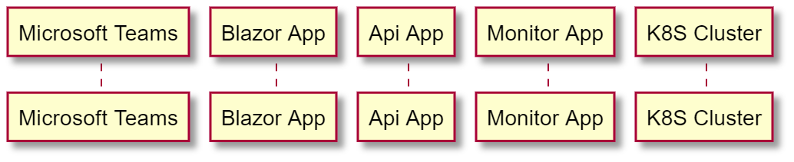

# 합치기빌런 #

애저 리소스를 마이크로소프트 팀즈에서 모니터링할 수 있는 종단간 통합 시나리오 샘플 애플리케이션입니다.


## 시나리오 ##

TBD


## 로컬 개발환경을 위한 사전 준비사항 ##

* [.NET 6 SDK](https://dotnet.microsoft.com/download/dotnet/6.0?WT.mc_id=dotnet-52121-juyoo&ocid=AID3035186)
* [비주얼 스튜디오 2022](https://visualstudio.microsoft.com/vs/?WT.mc_id=dotnet-52121-juyoo&ocid=AID3035186) 혹은 [비주얼 스튜디오 코드](https://code.visualstudio.com/?WT.mc_id=dotnet-52121-juyoo&ocid=AID3035186)
* [Azure Functions Core Tools](https://docs.microsoft.com/azure/azure-functions/functions-run-local?tabs=v4%2Cwindows%2Ccsharp%2Cportal%2Cbash%2Ckeda&WT.mc_id=dotnet-52121-juyoo&ocid=AID3035186)
* [Static Web Apps CLI](https://docs.microsoft.com/azure/static-web-apps/local-development?WT.mc_id=dotnet-52121-juyoo&ocid=AID3035186)


## 전체 아키텍처 다이어그램 ##


## 시퀀스 다이어그램 ##




## 시작하기 ##

로컬 개발 환경에서 합치기 빌런 전체 앱을 실행시키기 위해서는 아래와 같이 각각의 앱을 실행시켜야 합니다.

### 대시보드 앱 ###

모니터링을 위한 대시보드 앱은 아래와 같이 비주얼 스튜디오 혹은 비주얼 스튜디오 코드를 이용해 실행시킬 수 있습니다.


#### 비주얼 스튜디오에서 실행 ####

1. 비주얼 스튜디오 2022를 실행시킨다.
2. `IntegrationVillain.sln` 솔루션을 연다.
3. 솔루션 전체를 빌드한다.
4. `F5` 키를 눌러 앱을 실행시킨다.
5. AKS 클러스터 이름을 화면에 입력한 후 "**확인**" 버튼을 클릭한다.
6. 계속 클릭하면 아래 상태값이 `Running` 또는 `Stopped`가 되는 것을 확인한다.


#### 비주얼 스튜디오 코드에서 실행 ####

1. 비주얼 스튜디오 코드를 실행시킨다.
2. 터미널을 연다.
3. 아래 명령어를 실행시켜 솔루션 전체를 빌드한다.
    ```bash
    dotnet build .
    ```
4. 아래 명령어를 실행시켜 블레이저 웹 어셈블리 앱을 실행시킨다.
    ```bash
    dotnet watch run --project ./wrapperapp/Wrapper.WasmApp/
    ```
5. 새 터미널을 연다.
6. 아래 명령어를 실행시켜 애저 정적 웹 앱을 실행시킨다.
    ```bash
    swa start https://localhost:5001/ --api-location ./wrapperapp/Wrapper.ApiApp/
    ```
7. 웹 브라우저를 열고 주소창에 `http://localhost:4280`을 입력한다.
8. AKS 클러스터 이름을 화면에 입력한 후 "**확인**" 버튼을 클릭한다.
9. 계속 클릭하면 아래 상태값이 `Running` 또는 `Stopped`가 되는 것을 확인한다.

