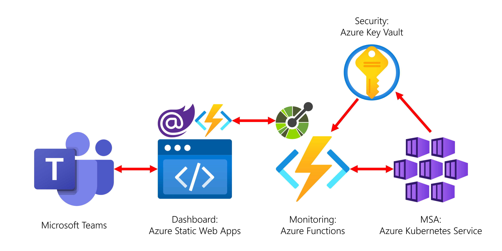

# 합치기 빌런 #

애저 리소스를 마이크로소프트 팀즈에서 모니터링할 수 있는 종단간 통합 시나리오 샘플 애플리케이션입니다.


## 시나리오 ##

* 회사에서는 저마다 [AKS](https://docs.microsoft.com/ko-kr/azure/aks/intro-kubernetes?WT.mc_id=dotnet-52121-juyoo&ocid=AID3035186)를 활용한 클라우드 네이티브 기반의 모던 웹 애플리케이션 개발, 배포 및 서비스 환경을 구성합니다.
* 그런데, 이런 환경에서는 애플리케이션의 상태를 모니터링할 수 있는 대시보드 앱이 필수적인데요, 이를 별도의 대시보드 앱을 구현해서 독립적으로 호스팅할 수도 있지만,
* [마이크로소프트 팀즈](https://www.microsoft.com/ko-kr/microsoft-teams/group-chat-software?WT.mc_id=dotnet-52121-juyoo&ocid=AID3035186)를 활용한 통합 업무 환경을 통해 컨텍스트 스위칭을 최소화시키면서 생산성 향상을 꾀할 수 있는 방법을 찾아봅니다.
* 이 합치기 빌런 시나리오는 바로 이 부분에서 팀즈가 어떤 식으로 활용될 수 있는지에 대한 방향을 제시합니다.


## 발표 자료 ##

* 슬라이드: [integrationvillain.pdf](./assets/integraionvillain.pdf)
* 동영상: TBA


## 로컬 개발환경을 위한 사전 준비사항 ##

* [node.js 16.x LTS](https://nodejs.org/ko/)
* [Python 3.8.x+](https://www.python.org/)
* [.NET 6 SDK](https://dotnet.microsoft.com/download/dotnet/6.0?WT.mc_id=dotnet-52121-juyoo&ocid=AID3035186)
* [비주얼 스튜디오 2022](https://visualstudio.microsoft.com/vs/?WT.mc_id=dotnet-52121-juyoo&ocid=AID3035186) 혹은 [비주얼 스튜디오 코드](https://code.visualstudio.com/?WT.mc_id=dotnet-52121-juyoo&ocid=AID3035186)
* [Azure Functions Core Tools](https://docs.microsoft.com/azure/azure-functions/functions-run-local?tabs=v4%2Cwindows%2Ccsharp%2Cportal%2Cbash%2Ckeda&WT.mc_id=dotnet-52121-juyoo&ocid=AID3035186)
* [Static Web Apps CLI](https://docs.microsoft.com/azure/static-web-apps/local-development?WT.mc_id=dotnet-52121-juyoo&ocid=AID3035186)


## 전체 아키텍처 다이어그램 ##




## 시작하기 ##

애저에 각 앱을 배포하기 위해서는 아래 순서를 따라해 보세요.

* [데모 Sock Shop 앱](./sampleapp)
* [모니터 앱](./monitorapp)
* [대시보드 앱](./wrapperapp)
* [팀즈 앱](./teamsapp)


대시 보드 앱은 로컬에서도 실행시킬 수 있습니다. 이를 위해서는 아래 순서를 따라해 보세요.


### 대시보드 앱 ###

모니터링을 위한 대시보드 앱은 아래와 같이 비주얼 스튜디오 혹은 비주얼 스튜디오 코드를 이용해 실행시킬 수 있습니다.


#### 비주얼 스튜디오에서 실행 ####

1. 비주얼 스튜디오 2022를 실행시킨다.
2. `IntegrationVillain.sln` 솔루션을 연다.
3. 솔루션 전체를 빌드한다.
4. `F5` 키를 눌러 앱을 실행시킨다.
5. AKS 클러스터 이름을 화면에 입력한 후 "**확인**" 버튼을 클릭한다.
6. 계속 클릭하면 아래 상태값이 `Running` 또는 `Stopped`가 되는 것을 확인한다.


#### 비주얼 스튜디오 코드에서 실행 ####

1. 비주얼 스튜디오 코드를 실행시킨다.
2. 터미널을 연다.
3. 아래 명령어를 실행시켜 솔루션 전체를 빌드한다.
    ```bash
    dotnet build .
    ```
4. 아래 명령어를 실행시켜 블레이저 웹 어셈블리 앱을 실행시킨다.
    ```bash
    dotnet watch run --project ./wrapperapp/Wrapper.WasmApp/
    ```
5. 새 터미널을 연다.
6. 아래 명령어를 실행시켜 애저 정적 웹 앱을 실행시킨다.
    ```bash
    swa start https://localhost:5001/ --api-location ./wrapperapp/Wrapper.ApiApp/
    ```
7. 웹 브라우저를 열고 주소창에 `http://localhost:4280`을 입력한다.
8. AKS 클러스터 이름을 화면에 입력한 후 "**확인**" 버튼을 클릭한다.
9. 계속 클릭하면 아래 상태값이 `Running` 또는 `Stopped`가 되는 것을 확인한다.

