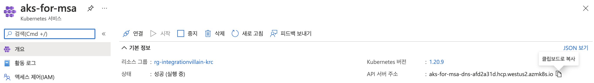

# Monitor App #

AKS 애플리케이션 상태를 모니터링하는 앱이 들어가는 디렉토리입니다.

아래 실행은 [Azure Cloud Shell](https://shell.azure.com)에서 실행할 수 있습니다. PowerShell 환경에서 쉘 스크립트를 실행시에는 `bash` 를 실행하여 사용합니다.
## Key Vault에 AKS Token을 저장

1. Azure Portal에서 Key Vault을 생성합니다.

2. `sampleapp` 마지막 과정에서 얻은 $TOKEN 값을 복사합니다.

3. `(optional)` 가져온 $TOKEN으로 액세스가 잘 되는지 테스트
- `[AKS_API_URL]` 값은 생성한 AKS 리소스에 대해 Azure Portal에서 접근하여 확인 가능합니다.


```bash
$ APIADDR=[AKS_API_URL]
$ curl -k -H "Authorization: Bearer $TOKEN" https://$APIADDR/api/v1/namespaces/sock-shop
```

4. 출력된 TOKEN값을 *AKSTokenFromKeyVault* 이라는 KeyVault에 비밀(Secret)로 저장
- 시크릿 이름: `AKSTokenFromKeyVault`
- 시크릿 값: (위에서 얻은 $TOKEN 값을 사용합니다)

5. Azure Portal에서 생성한 시크릿을 클릭 후, 현재 버전(CURRENT VERSION)을 클릭하면 `Secret Identifier`가 있습니다. 이를 클립보드에 복사하여 아래 설정에서 활용합니다.


## Function App을 배포 후 Key Vault를 통해 AKS Token에 액세스하도록 설정

1. 새 Azure Function App을 만듭니다. `Python 3.8`을 선택합니다.
- ARM 템플릿 참고 (폴더: `templates`)

2. Visual Studio Code를 통해 로컬 환경에서 Function App을 실행 & 테스트 가능합니다.
- `local.settings.json` 파일에 다음 2개를 "Values" 내에 추가합니다.
  - `[AKS_API_URL]` 값은 생성한 AKS 리소스에 대해 Azure Portal에서 접근하여 확인 가능합니다.
  - `AKS_TOKEN_FROM_KEYVAULT` 값은 $TOKEN 문자열 전체를 그대로 붙여넣으면 됩니다.
```
    "AKSTokenFromKeyVault": "AKS_TOKEN_FROM_KEYVAULT",
    "AKSAPIURL": "https://[AKS_API_URL]"
```

3. `monitorapp` 디렉토리에 있는 Function App을 배포합니다. (위와 같이 테스트하더라도 `local.settings.json` 설정 내용은 업로드되지 않습니다.)

4. `구성(Settings) -> 애플리케이션 설정(Configuration)`에서 다음 2가지를 추가 후 저장합니다. 이 때, `[SECRET_IDENTIFIER]`는 이전에 가져온 `Secret Identifier`를 사용합니다.

- ``AKSAPIURL``: "https://"를 앞에 붙여 AKS API URL 값을 저장 (예: "https://[AKS API URL]")
- ``AKSTokenFromKeyVault``: `@Microsoft.KeyVault(SecretUri=[SECRET_IDENTIFIER])`


5. `구성(Settings) -> ID(Identity)`에서 상태(Status)가 Off되어 있는 부분을 *On*으로 바꾸고 저장합니다.

6. 이전에 생성한 `Key Vault` 리소스에서 설정 -> 액세스 정책을 클릭한 후, "액세스 정책 추가"를 클릭하여 추가를 합니다.
- `비밀 권한`에 *가져오기*와 *나열*을 선택합니다.
- `주체 선택`을 클릭 후 생성한 Azure Function 이름으로 검색하면 나옵니다. 이를 선택합니다.
- `추가` 버튼을 클릭합니다.

7. Azure Function API 테스트가 가능할 것입니다 :)