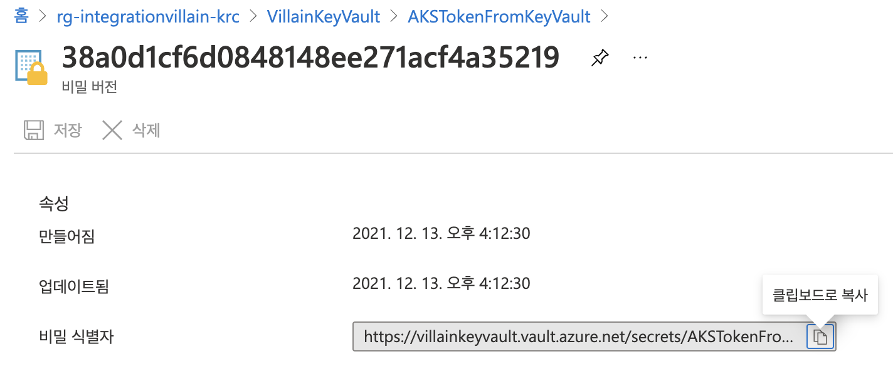
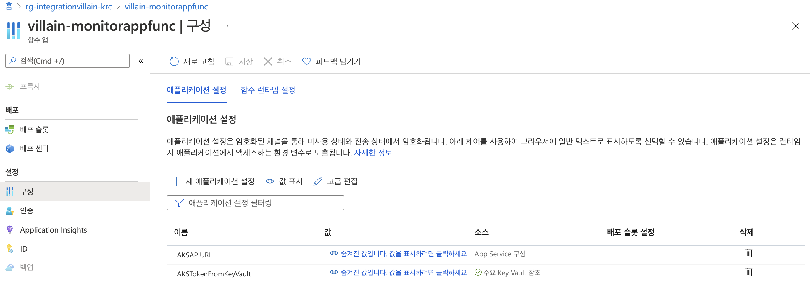

# Monitor App #

AKS 매니지드 클러스터의 상태를 모니터링하는 애저 펑션 앱을 배포합니다.

아래 내용은 [애저 클라우드 셸](https://shell.azure.com?WT.mc_id=dotnet-52121-juyoo&ocid=AID3035186)을 통해 실행할 수 있습니다. bash Shell 환경을 기준으로 설명합니다.


## Key Vault 인스턴스 생성 및 AKS 매니지드 클러스터 API 토큰 저장 ##

1. Azure Portal에서 Key Vault을 생성합니다.

2. `sampleapp` 마지막 과정에서 얻은 AKS 매니지드 클러스터 API에 접근하기 위한 $TOKEN 값을 복사합니다.

3. 출력된 TOKEN값을 *AKSTokenFromKeyVault* 이라는 KeyVault에 비밀(Secret)로 저장합니다.
    - 시크릿 이름: `AKSTokenFromKeyVault`
    - 시크릿 값: (위에서 얻은 $TOKEN 값을 사용합니다)

4. Azure Portal에서 생성한 시크릿을 클릭 후, 현재 버전(CURRENT VERSION)을 클릭하면 `Secret Identifier`가 있습니다. 이를 클립보드에 복사하여 아래 설정에서 활용합니다.

    


## 애저 펑션 앱 배포 및 Key Vault 연동 ##

1. 우선 소스코드가 들어 있는 깃헙 리포지토리를 애저 클라우드 셸로 다운로드 받습니다.

    ```bash
    git clone https://github.com/devrel-kr/integration-villain.git
    ```

2. 아래 애저 CLI 명령어를 사용해서 애저 펑션과 관련한 인스턴스들을 생성합니다. 이 때 런타임 환경으로는 `Python 3.8`을 선택합니다.

    ```bash
    cd ~/integration-villain/monitorapp/templates

    $MONITORAPP_NAME=<모니터 펑션앱 이름>
    $HOSTINGPLAN_NAME=<애저펑션 소비플랜 이름>
    $STORAGE_NAME=<애저 저장소 이름>

    az deployment group create \
        -g $RESOURCE_GROUP \
        -n monitoringapp \
        --template-file template.json \
        --parameters @parameters.json \
        --parameters name=$MONITORAPP_NAME \
        --parameters location=$LOCATION \
        --parameters hostingPlanName=$HOSTINGPLAN_NAME \
        --parameters storageAccountName=$STORAGE_NAME \
        --parameters aksApiUrl=https://$AKS_API_URL \
        --parameters aksApiToken=$TOKEN \
        --verbose
    ```

    위와 같이 애저 펑션 인스턴스를 생성할 때 기본값으로 지정하는 부분은 아래와 같습니다.

    - Python 런타임 버전: `3.8`

3. `monitorapp` 디렉토리에 있는 Function App을 아래 명령어를 통해 배포합니다.

    ```bash
    cd ~/integration-villain/monitorapp

    cp local.settings.sample.json local.settings.json

    func azure functionapp publish $MONITORAPP_NAME
    ```

4. `구성(Settings) -> 애플리케이션 설정(Configuration)`에서 다음의 두 설정값을 추가 후 저장합니다. 이 때, `[SECRET_IDENTIFIER]`는 이전에 가져온 `Secret Identifier`를 사용합니다.

    - `AKSAPIURL`: "https://"를 앞에 붙여 AKS API URL 값을 저장 (예: "https://[AKS API URL]")
    - `AKSTokenFromKeyVault`: `@Microsoft.KeyVault(SecretUri=[SECRET_IDENTIFIER])`

    

5. 이전에 생성한 `Key Vault` 리소스에서 설정 -> 액세스 정책을 클릭한 후, "액세스 정책 추가"를 클릭하여 추가를 합니다.

    - `비밀 권한`에 *가져오기*와 *나열*을 선택합니다.
    - `주체 선택`을 클릭 후 생성한 Azure Function 이름으로 검색하면 나옵니다. 이를 선택합니다.
    - `추가` 버튼을 클릭합니다.

6. 아래 명령어를 통해 애저 펑션의 엔드포인트를 테스트합니다.

    ```bash
    FUNCTIONAPP_URL=$(az functionapp show \
        -g $RESOURCE_GROUP \
        -n $MONITORAPP_NAME \
        --query "defaultHostName" \
        -o tsv)

    curl https://$FUNCTIONAPP_URL/api/AKSClusterStatus?name=sock-shop
    curl https://$FUNCTIONAPP_URL/api/AKSClusterStatus?name=my-aks
    ```
