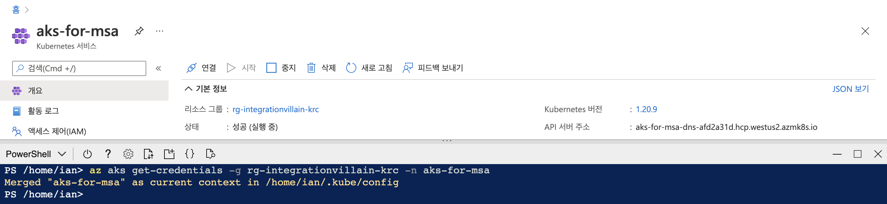
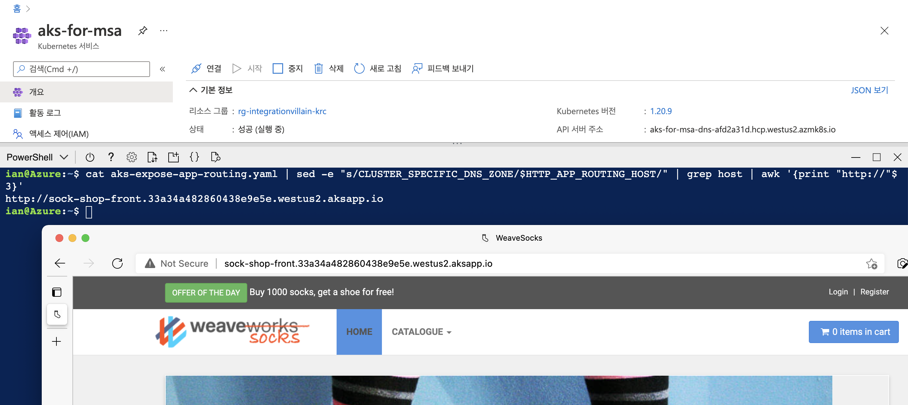

# Sample App #

AKS에 올라가는 샘플 애플리케이션을 배포합니다.


아래 내용은 [애저 클라우드 셸](https://shell.azure.com?WT.mc_id=dotnet-52121-juyoo&ocid=AID3035186)을 통해 실행할 수 있습니다. bash Shell 환경을 기준으로 설명합니다.


## AKS 매니지드 클러스터 생성 ##

1. 아래 [애저 CLI](https://docs.microsoft.com/ko-kr/cli/azure/what-is-azure-cli?WT.mc_id=dotnet-52121-juyoo&ocid=AID3035186) 명령어를 이용해서 AKS 매니지드 클러스터 리소스를 생성합니다.

    ```bash
    RESOURCE_GROUP=<리소스그룹 이름>
    LOCATION=<지역>
    AKS_MANAGER=<AKS 클러스터 이름>
    AKS_API_DNS=<AKS API DNS 이름>
    
    az deployment group create \
        -g $RESOURCE_GROUP \
        -n aksmanaged \
        --template-uri https://raw.githubusercontent.com/devrel-kr/integration-villain/main/sampleapp/templates/template.json \
        --parameters https://raw.githubusercontent.com/devrel-kr/integration-villain/main/sampleapp/templates/parameters.json \
        --parameters location=$LOCATION \
        --parameters resourceName=$AKS_MANAGER \
        --parameters dnsPrefix=$AKS_API_DNS \
        --verbose
    ```

    위와 같이 AKS 매니지드 클러스터 생성시 기본값으로 지정하는 부분은 아래와 같습니다.

    - Kubernetes 버전: `1.20.9` (현재 안정 버전)
    - VM 사이즈: `Standard_B4ms` (데모 용도로 적당한 VM 사이즈)

## 데모용 앱 배포 ##

1. AKS 크레덴셜을 이용해 kubectl 을 사용할 수 있게끔 준비합니다.

    ```bash
    az aks get-credentials \
        -g $RESOURCE_GROUP \
        -n $AKS_MANAGER \
        --verbose
    ```

    

2. 오픈소스로 공개된 데모용 [Sock Shop 앱](https://github.com/microservices-demo/microservices-demo)을 AKS에 배포합니다.

    ```bash
    AKS_NAMESPACE=sock-shop

    curl -O https://raw.githubusercontent.com/microservices-demo/microservices-demo/master/deploy/kubernetes/complete-demo.yaml

    kubectl create namespace $AKS_NAMESPACE
    kubectl apply -f complete-demo.yaml
    ```

3. AKS 매니지드 클러스터에 생성한 Sock Shop 앱을 확인하기 위해 HTTP Application Routing 값을 이용해 호스트 값을 수정합니다.

    ```bash
    curl -O https://raw.githubusercontent.com/devrel-kr/integration-villain/main/sampleapp/aks-expose-app-routing.yaml

    HTTP_APP_ROUTING_HOST=$(az aks show \
        -g $RESOURCE_GROUP \
        -n $AKS_MANAGER \
        --query addonProfiles.httpApplicationRouting.config.HTTPApplicationRoutingZoneName \
        -o tsv)

    cat aks-expose-app-routing.yaml | \
        sed -e "s/CLUSTER_SPECIFIC_DNS_ZONE/$HTTP_APP_ROUTING_HOST/" | \
        kubectl apply -f -
    ```

4. 아래 명령어를 통해 웹사이트의 URL을 확인하고 웹 브라우저에서 열어 Sock Shop 앱이 제대로 작동하는 것을 확인합니다.

    ```bash
    cat aks-expose-app-routing.yaml | \
        sed -e "s/CLUSTER_SPECIFIC_DNS_ZONE/$HTTP_APP_ROUTING_HOST/" | \
        grep host | \
        awk '{print "http://"$3}'
    ```




## AKS 매니지드 클러스터 API 액세스 ##

1. 모니터링에 사용할 쿠버네티스 클러스터의 서비스 계정을 만들고 role-binding을 수행합니다.

    ```bash
    NICK=<서비스 계정명>
    
    kubectl -n sock-shop create sa $NICK
    
    curl -O https://raw.githubusercontent.com/devrel-kr/integration-villain/main/sampleapp/aks-role-binding.yaml
    
    cat aks-role-binding.yaml | \
        sed -e "s/NICK/$NICK/" |kubectl create -f -
    ```

2. 이후 아래 명령어를 사용해 AKS 매니지드 클러스터의 API에 액세스할 때 사용하기 위한 토큰 값을 얻습니다.

    ```bash
    TOKEN=`kubectl get secrets -n sock-shop $(kubectl get sa -n sock-shop $NICK -o jsonpath="{.secrets[0].name}") -o jsonpath="{.data.token}" | base64 -d`
    
    echo $TOKEN
    ```

3. AKS 매니지드 클러스터 API에 접근하기 위한 URL을 확인합니다.

    ```bash
    AKS_API_URL=$(az aks show \
        -g $RESOURCE_GROUP \
        -n $AKS_MANAGER \
        --query "fqdn" \
        -o tsv)
    ```

4. 마지막으로 실제 AKS 매니지드 클러스터 API를 호출해서 Sock Shop 앱이 잘 작동하는지 확인합니다.

    ```bash
    curl -k -H "Authorization: Bearer $TOKEN" https://$AKS_API_URL/api/v1/namespaces/sock-shop
    ```
